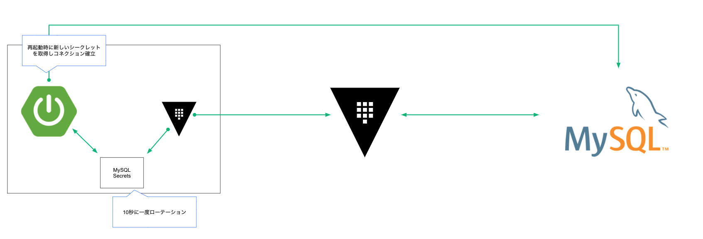

## setup
```shell script
vault policy write read-gcp-gsql -<<EOF
path "gcp/*" {
  capabilities = ["read"]
}
path "database/static-creds/static-gsql" {
  capabilities = ["read"]
}
EOF
```

```shell script
vault write auth/approle/role/read-gcp-gsql token_policies=read-gcp-gsql
vault read -format=json auth/approle/role/read-gcp-gsql/role-id \
  | jq -r '.data.role_id'> agent-config/roleid
vault write -force -format=json auth/approle/role/read-gcp-gsql/secret-id \
 | jq -r '.data.secret_id'> agent-config/secretid
```

```shell script
vault write database/config/mysql-gcp \
  plugin_name=mysql-legacy-database-plugin \
  connection_url="{{username}}:{{password}}@tcp(35.221.93.48)/" \
  allowed_roles="static-gsql" \
  username="root" \
  password="rooooot"
```

```shell script
vault write database/static-roles/static-gsql \
  db_name=mysql-gcp \
  rotation_statements="SET PASSWORD FOR  "{{name}}" = PASSWORD ('{{password}}');" \
  username="webapp_default" \
  rotation_period=120
```

```sql
CREATE USER 'webapp_default' IDENTIFIED BY 'webapp_default';
GRANT SELECT,INSERT,UPDATE ON handson.* TO 'webapp_default';
```